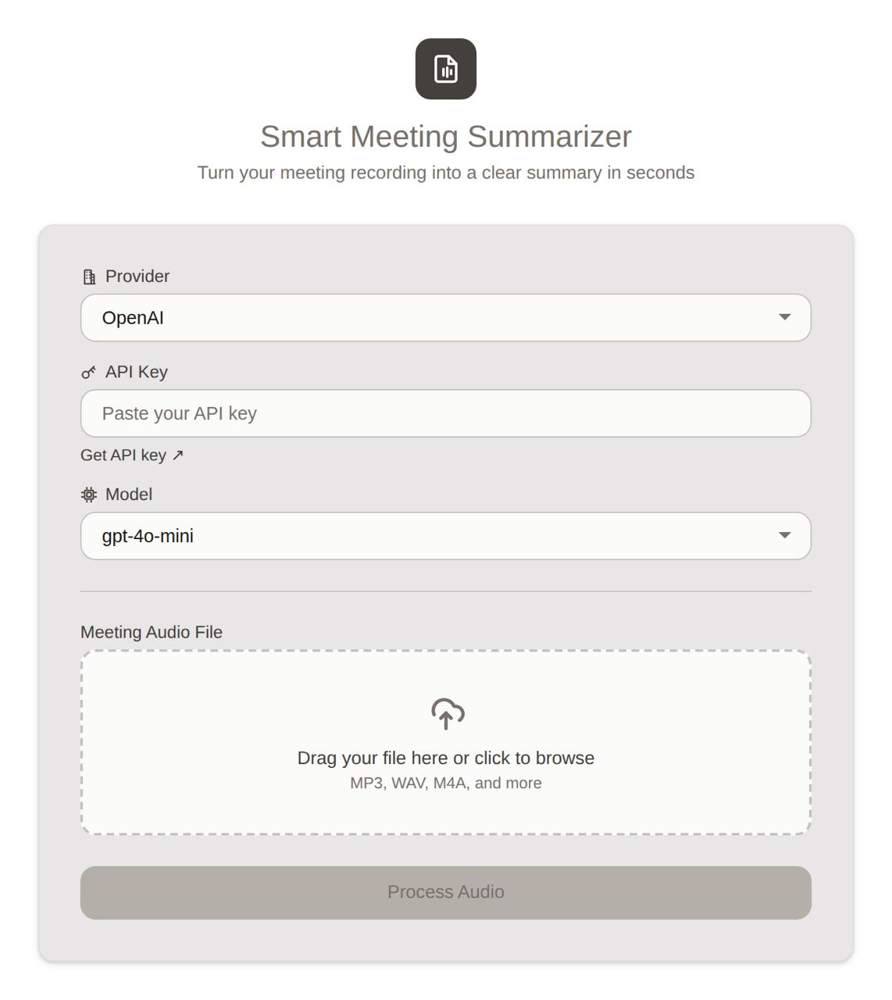

# 📋 Smart Meeting Summarizer

Convert meeting recordings into automatic summaries with AI-powered transcription.

## Screenshots



=====================================

## Features

- Automatic Summarization - AI generates clear bullet-point summaries
- Accurate Transcription - OpenAI Whisper speech-to-text technology
- Multi-Provider Support - 7 AI providers + custom OpenAI-compatible endpoints
- BYOK (Bring Your Own Key) - Use your own API credentials, nothing stored server-side
- Easy Copy - Copy summary or transcript with one click
- Responsive Design - Works on desktop and mobile

=====================================

## Tech Stack

- Backend: FastAPI with LiteLLM
- Speech-to-Text: OpenAI Whisper (base model)
- Summarization: 7 providers via LiteLLM (OpenAI, Gemini, Anthropic, Mistral, Groq, DeepSeek, xAI) + custom endpoints
- Frontend: Vanilla JavaScript

## Prerequisites

- Python 3.8+
- API key from your chosen provider (OpenAI, Gemini, Anthropic, Mistral, Groq, DeepSeek, or xAI)

=====================================

## Quick Setup

Clone the repo and run locally:

```bash
# Clone and enter directory
git clone https://github.com/RuefAbahussain/SmartMeetingSummarizer.git
cd SmartMeetingSummarizer

# Install dependencies
pip install -r backend/requirements.txt

# Run the server
python backend/main.py
```

Open **http://127.0.0.1:8000** in your browser.

**Supported AI Providers:**
OpenAI • Google Gemini • Anthropic Claude • Mistral • Groq • DeepSeek • xAI (Grok) • Custom endpoints

=====================================

## How to Use

1. Select your AI provider from the dropdown
2. Paste your API key for that provider
3. (For custom endpoints) Enter the Base URL if using a custom OpenAI-compatible endpoint
4. Click the upload box to select an audio file (MP3, WAV, M4A, OGG, WebM, FLAC, etc.)
5. Click "Process Audio"
6. Wait for transcription and summarization
7. Copy the summary or transcript as needed

=====================================

## Project Structure

```
Smart Meeting Summarizer/
├── backend/
│   ├── main.py              # FastAPI server
│   └── requirements.txt      # Python dependencies
├── frontend/
│   ├── index.html           # Web interface
│   └── static/
│       ├── js/app.js        # Frontend logic
│       └── css/style.css    # Styling
└── README.md                # This file
```

=====================================

## Security Testing

This web application has been tested for security vulnerabilities using Burp Suite:

- **SSRF:** Reject all requests to private IPs (169.254.169.254, 10.x.x.x, 192.168.x.x, localhost) and require HTTPS only
- **XSS:** Strict Content Security Policy, X-Frame-Options: DENY, all user input escaped via textContent
- **Prompt Injection:** Transcript wrapped in `<transcript>` tags with explicit instructions marking it as raw data, not commands
- **DoS/DDoS:** Rate limit 10 uploads/minute per IP, max 2 concurrent transcriptions, 25MB file size limit
- **API Key Exposure:** BYOK model — credentials sent per-request only, never stored; error messages are generic (no API details leaked)
- **Unrestricted File Upload:** File type verified via magic bytes (not extension), only audio MIME types allowed
- **Path Traversal:** Files written to system temp directory with auto-generated names, auto-deleted after processing

=====================================

Built by Reoof Abahussain ★

